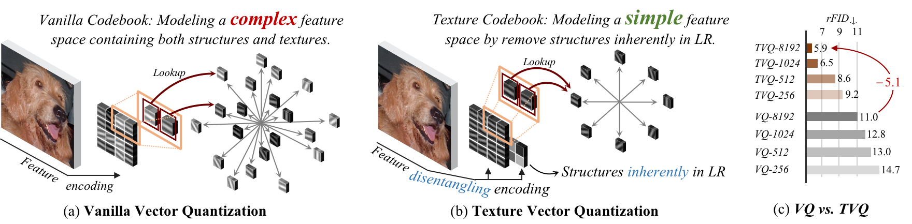

<div align="center">


<h2>
Texture Vector-Quantization and Reconstruction Aware Prediction for Generative Super-Resolution
</h2>

[Qifan Li](),  Jiale Zou,  [Jinhua Zhang](https://scholar.google.com/citations?user=tyYxiXoAAAAJ),  [Wei Long](https://scholar.google.com/citations?user=CsVTBJoAAAAJ), [Xingyu Zhou](https://scholar.google.com/citations?user=dgO3CyMAAAAJ&hl=zh-CN&oi=sra),  [Shuhang Gu](https://scholar.google.com/citations?user=-kSTt40AAAAJ)

[](https://arxiv.org/pdf/2509.23774)
[](https://github.com/LabShuHangGU/TVQ-RAP)

</div>


⭐If you like this work, please help star this repo. Thanks!🤗
 

## Performance
<p align="center">
    
</p>


## <a name="news"></a> 📰 News
- The code will be coming soon.


<!-- ## <a name="cite"></a> 🥰 Citation

Please cite us if our work is useful for your research.

```
@article{zhang2025mvar,
  title={MVAR: Visual Autoregressive Modeling with Scale and Spatial Markovian Conditioning},
  author={Zhang, Jinhua and Long, Wei and Han, Minghao and You, Weiyi and Gu, Shuhang},
  journal={arXiv preprint arXiv:2505.12742},
  year={2025}
}
``` -->


## Contact

If you have any questions, feel free to approach me at qifanli.lqf@gmail.com 
